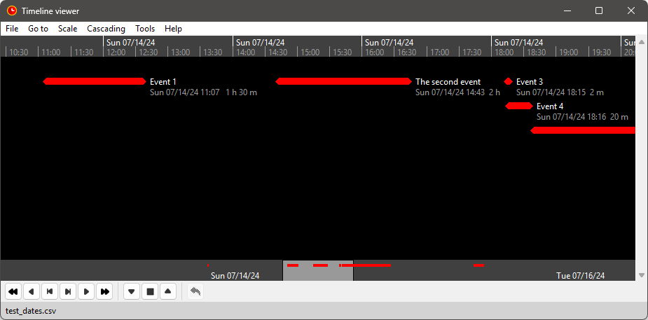

#  timeline-view-tk

A timeline viewer programmed with Python, using tkinter.

The data is read from a csv file:

The *nvtlview* class library provides the *tlv* widget that is addressed via its controller.

*Timeline_viewer* is a simple standalone application using *nvtlview* 
with a menu and a toolbar. 

## Features

- The application reads the timeline data from a csv file and displays it on a resizable 
  window.
- Events can be defined with a specific date or with an unspecific day.
- For the specific date, the Gregorian calendar is used.
  Only positive dates with years between 0001 and 9999 are accepted.
- For the day zero, you can define a reference date, so that events with unspecific dates 
  can be placed on a calendar scale.  
- You can increase and reduce the time scale. 
- You can scroll forward and back in time.
- You can move the events along the time scale using the mouse.
- You can adjust the events' durations using the mouse.
- The application is ready for internationalization with GNU gettext. 

The *nvtlview* class library is also used for the 
[novelibre timeline viewer plugin](https://github.com/peter88213/nv_tlview/),
and for the 
[yWriter Timeline viewer](https://github.com/peter88213/yw_tlview)
for example.

## Translations

There is a [German language pack](https://github.com/peter88213/tlviewer_de) to be installed separately. 

## Requirements

- Windows or Linux. Mac OS support is experimental.
- [Python](https://www.python.org/) version 3.6+. 

---

- [Changelog](docs/changelog.md)
- [User guide (English)](https://peter88213.github.io/timeline-view-tk/help/)
- [User guide (German)](https://peter88213.github.io/tlviewer_de/help/)
- [Feedback](https://github.com/peter88213/timeline-view-tk/discussions)

---

## Download and install

### Default: Executable Python zip archive

Download the latest release [timeline_viewer_v0.8.1.pyzw](https://github.com/peter88213/timeline-view-tk/raw/main/dist/timeline_viewer_v0.8.1.pyzw)

- Launch *timeline_viewer_v0.8.1.pyzw* by double-clicking (Windows/Linux desktop),
- or execute `python timeline_viewer_v0.8.1.pyzw` (Windows), resp. `python3 timeline_viewer_v0.8.1.pyzw` (Linux) on the command line.

#### Important

Many web browsers recognize the download as an executable file and offer to open it immediately. 
This starts the installation.

However, depending on your security settings, your browser may 
initially  refuse  to download the executable file. 
In this case, your confirmation or an additional action is required. 
If this is not possible, you have the option of downloading 
the zip file. 

### Alternative: Zip file

The package is also available in zip format: [timeline_viewer_v0.8.1.zip](https://github.com/peter88213/timeline-view-tk/raw/main/dist/timeline_viewer_v0.8.1.zip)

- Extract the *timeline_viewer_v0.8.1* folder from the downloaded zipfile "timeline_viewer_v0.8.1.zip".
- Move into this new folder and launch *setup.pyw* by double-clicking (Windows/Linux desktop), 
- or execute `python setup.pyw` (Windows), resp. `python3 setup.pyw` (Linux) on the command line.

---

## Credits

- The logo and the toolbar icons are based on the [Eva Icons](https://akveo.github.io/eva-icons/#/), published under the [MIT License](http://www.opensource.org/licenses/mit-license.php). The original black and white icons were adapted for this application by the maintainer. 

---

## License

This is Open Source software, and *timeline-view-tk* is licensed under GPLv3. See the
[GNU General Public License website](https://www.gnu.org/licenses/gpl-3.0.en.html) for more
details, or consult the [LICENSE](https://github.com/peter88213/timeline-view-tk/blob/main/LICENSE) file.

